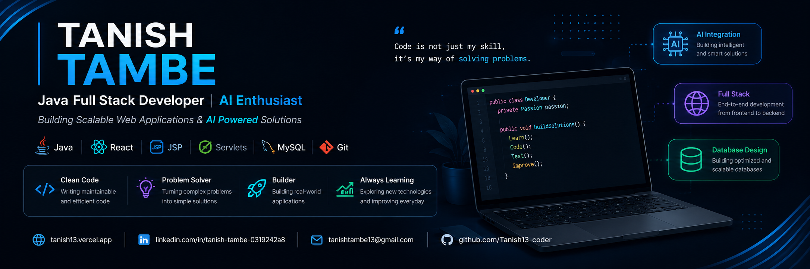

<h1 align="center">Hi 👋, I'm Tanish Tambe</h1>

<h3 align="center">
Java Full Stack Developer • AI Enthusiast • Computer Engineering Graduate
</h3>

---

# 💫 About Me

🎓 Computer Engineering Graduate (SPPU)

💼 Java Full Stack Developer passionate about building scalable software

🤖 Interested in Artificial Intelligence, Backend Systems & Full Stack Development

📄 Published Research Paper in **IJARSCT**

🏆 Oracle Cloud Infrastructure Certified

🚀 Hackathon Participant (NASA Space Apps & Smart India Hackathon)

🌱 Currently learning **Spring Boot, System Design & Advanced DSA**

---

# 🚀 Currently Working On

- 🚀 Enhancing **CodeInsight**
- 🌱 Spring Boot & Microservices
- 📚 Data Structures & Algorithms
- 🤝 Open Source Contributions
- ☁ Cloud & Backend Development

---

# 🛠 Tech Stack

### Languages

### Frontend

### Backend

### Database

### Tools

---

# 🚀 Featured Projects

# 🤖 CodeInsight

### AI Powered Code Evaluation Platform

> An intelligent coding platform where users solve coding problems, execute code online, receive AI-generated feedback, monitor progress, and compete through leaderboards.

### 🚀 Features

- 🤖 AI Generated Code Feedback
- ⚡ Online Code Execution
- 💻 Monaco Code Editor
- 📈 Performance Analytics
- 📚 Coding Problem Management
- 🏆 Leaderboards
- 👤 Secure Authentication
- 📊 Progress Tracking

### ⚙ Tech Stack

Java • JSP • Servlets • JDBC • MySQL • ReactJS

**Repository**

👉 https://github.com/Tanish13-coder/CodeInsight

---

# 🏠 RentMate

### Full Stack Rental Management System

> A complete rental management application connecting owners and tenants through a secure and efficient platform.

### 🚀 Features

- 🏠 Property Management
- 👤 Tenant Dashboard
- 🏢 Owner Dashboard
- 💳 Payment History
- 📊 Analytics Dashboard
- 🔐 Authentication
- 🗂 Role Based Access
- 📱 Responsive Interface

### ⚙ Tech Stack

Java • JSP • Servlets • JDBC • MySQL • HTML • CSS • JavaScript

**Repository**

👉 https://github.com/Tanish13-coder/RentMate

---

# 🌎 AstroClime

### NASA Space Apps Challenge Project

> A climate intelligence platform developed during NASA Space Apps Challenge to visualize and analyze climate-related information.

### 🚀 Features

- 🌍 Climate Analytics
- 📈 Data Visualization
- 📍 Location Insights
- 🌦 Weather Information
- 📊 Interactive Dashboard

### ⚙ Tech Stack

HTML • CSS • JavaScript

**Repository**

👉 https://github.com/Tanish13-coder/AstroClime

---

# 🏆 Certifications & Achievements

🏅 Oracle Cloud Infrastructure Certified Foundations Associate

🚀 NASA Space Apps Challenge Participant

🏆 Smart India Hackathon Participant

📄 Research Paper Published (IJARSCT)

💼 Java Full Stack Development Internship

---

# 📊 GitHub Statistics

---

# 🏆 GitHub Trophies

---

# 📈 Contribution Graph

---

# 🌐 Connect With Me

---

# 💡 Quote

> **"Great software isn't written by accident. It's built one commit at a time."**

---

### ⭐ Thanks for visiting my profile!

If you like my work, consider ⭐ starring my repositories.

**Code • Learn • Build • Improve • Repeat**

